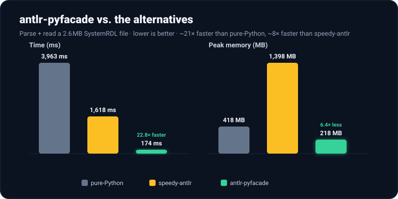

<p align="center">
  <picture>
    <source media="(prefers-color-scheme: dark)" srcset="docs/assets/logo-dark.svg">
    
  </picture>
</p>

<p align="center">
  <a href="https://github.com/zuzukin/antlrope/actions/workflows/ci.yml?query=branch%3Adev"></a>
  <a href="https://app.codecov.io/gh/zuzukin/antlrope/tree/dev"></a>
  <a href="https://pypi.org/project/antlrope/"></a>
  <a href="https://anaconda.org/conda-forge/antlrope"></a>
  <a href="https://pypi.org/project/antlrope/"></a>
  <a href="https://zuzukin.github.io/antlrope/"></a>
</p>

A fast, C++-accelerated [ANTLR](https://www.antlr.org/) runtime for Python for target-agnostic grammars

*antl**rope*** = ANTLR + **O**rdered **P**arse **E**vents — your parse delivered as one ordered stream of events, not a per-node tree walk.

> **10–20× faster** than the official pure-Python `antlr4-python3-runtime` on
> workloads that touch most nodes — and more when your listener subscribes to
> only a subset of the grammar.

[](docs/benchmarks/systemrdl.md)

<sub>Parsing + reading a real 2.6 MB SystemRDL file — see the [full benchmark](docs/benchmarks/systemrdl.md) (vs the pure-Python runtime and the `speedy-antlr` accelerator).</sub>

Generate your parser with the ordinary ANTLR tool targeting Python, install
this package, generate a small *facade* class, and write a pure-Python event listener.
Parsing itself runs inside the official ANTLR4 **C++** runtime, driven directly
from the serialized ATN (Augmented Transition Network) the stock Python target already emits.
Instead of a per-node parse-tree walk (one foreign-function crossing per tree node), the C++
side collects a **single bulk, filtered event stream** and hands it to Python in
one transfer — and it drops the rules/tokens your listener doesn't subscribe to
*before* they ever reach Python.

It complements, rather than replaces, the official `antlr4-python3-runtime`: same
generated parser, a faster way to consume it.

## Install

From PyPI:

```sh
pip install antlrope
```

Or from conda-forge (with conda, mamba, or pixi):

```sh
conda install -c conda-forge antlrope
```

Either way you get a pre-compiled binary — nothing to build — and the official
`antlr4-python3-runtime` is pulled in automatically.

## Quickstart

1. **Generate your parser** with the stock ANTLR tool (Python target):

   ```sh
   antlr4 -Dlanguage=Python3 MyGrammar.g4 -o generated
   ```

2. **Generate the facade** from the generated parser module:

   ```sh
   antlrope gen generated.MyGrammarParser MyGrammar -o my_listener.py
   ```

   This emits a `MyGrammarEventListener` base class with `enter<Rule>` /
   `exit<Rule>` / `visitTerminal` / `visitError` stubs and token-type constants.
   The facade also imports and bakes in your lexer/parser, so you never pass them
   at parse time. The lexer module is derived from the parser's by ANTLR's
   `<Grammar>Lexer` / `<Grammar>Parser` convention; pass `--lexer` if yours is
   named differently.

3. **Subclass it** and override only the callbacks you care about:

   ```python
   from my_listener import MyGrammarEventListener

   class Collector(MyGrammarEventListener):
       def enterPair(self) -> None:
           ...
       def visitTerminal(self, token_type: int, text: str) -> None:
           ...

   Collector().walk(source_text)
   ```

Only the callbacks you override drive native masks, so the C++ side skips every
other rule/token — the fewer node kinds you subscribe to, the faster the walk.

## How it works

- The C++ extension deserializes the ATN from your generated lexer/parser and
  drives `LexerInterpreter` / `ParserInterpreter` — no generated C++ parser.
- A native iterative depth-first traversal over the finished parse tree appends
  fixed `(kind, payload, start, stop)` int32 records to one buffer (`parse_events`).
- `kind`: `0=ENTER_RULE, 1=EXIT_RULE, 2=TERMINAL, 3=ERROR`; `payload` is the rule
  index or token type; `start`/`stop` are char indices into the source (`-1` for
  rule events). Token text is recovered Python-side by slicing
  `text[start:stop + 1]` — no string copies cross the boundary.
- Rule/token masks built from your overrides filter the stream in C++.

## Limitations

This can only be used for target-language-agnostic grammars.
This runtime executes the **interpreted ATN**; it cannot run target-language
**semantic predicates or embedded grammar actions**. Grammars that depend on
them will not parse correctly here. See `docs/` for the full discussion and the
performance characteristics of the bulk event-stream approach.

## Contributing

Development setup, pixi environments, and the vendored-runtime workflow live in
[CONTRIBUTING.md](CONTRIBUTING.md).

## Documentation

Full documentation: **[zuzukin.github.io/antlrope](https://zuzukin.github.io/antlrope/)**.
In the repo, see [`docs/`](docs/index.md): [getting started](docs/getting-started.md),
[installation](docs/installation.md),
[API reference](docs/reference/api.md),
[chunking](docs/chunking.md),
[migrating from antlr4-python3-runtime](docs/migrating.md),
[performance & limitations](docs/performance.md),
[how it works](docs/concepts.md), and the
[SystemRDL benchmark](docs/benchmarks/systemrdl.md).

Using an **AI coding assistant** to write a listener (or port a
`ParseTreeListener`)? Give it the LLM-oriented docs summary at
[zuzukin.github.io/antlrope/llms.txt](https://zuzukin.github.io/antlrope/llms.txt)
plus your grammar — and, when porting, your existing listener.

## License

Apache-2.0. Bundles the ANTLR4 C++ runtime (BSD-3-Clause) under
`vendor/antlr4-cpp/`; see `vendor/antlr4-cpp/UPDATING.md` for provenance.
